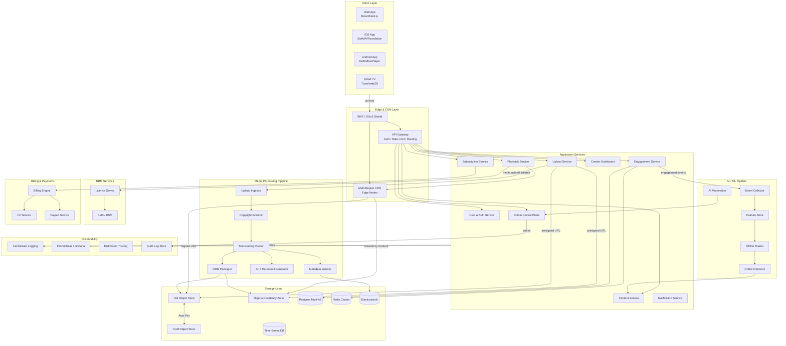

The diagram below represents the complete MCSP component graph at v1. Arrows indicate the primary data or event flow direction. All flows from the client layer pass through the edge zone — no service in the application layer is directly reachable from the internet.

---

## Layer Summary

| Layer | Primary Role |
|---|---|
| **Client** | Web, iOS, Android, and Smart TV applications consuming the platform |
| **Edge** | WAF, DDoS protection, CDN segment delivery, API Gateway auth and routing |
| **Application Services** | Business logic microservices — stateless, independently scalable |
| **Media Processing** | Fully async pipeline: ingest → scan → transcode → package → index |
| **AI / ML** | Behavioural event collection, feature engineering, recommendation inference, AI moderation |
| **Storage** | Purpose-fit stores: Postgres, object storage (hot/cold/residency), Elasticsearch, Redis, time-series |
| **DRM** | License server fleet and HSM-backed key management |
| **Billing** | Subscription lifecycle, recurring charges, FX conversion, creator payouts |
| **Observability** | Logs, metrics, traces, and the append-only audit store |

For a detailed breakdown of each layer's responsibilities, scaling model, and failure domains, see [Layer Breakdown](/architecture/layer-breakdown).