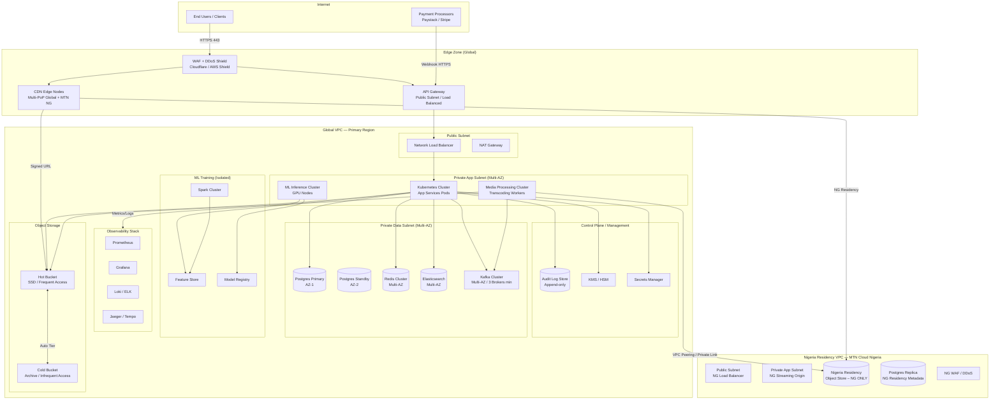

## Infrastructure Diagram

---

## Network Boundaries

| Zone | Access Model |
|---|---|
| **Internet → Edge** | Public HTTPS only. All traffic passes through WAF before reaching CDN or API Gateway. |
| **Edge → App Subnet** | API Gateway → Network Load Balancer → Kubernetes pods in private subnet. No direct internet access to pods. |
| **App Subnet → Data Subnet** | Private subnet routing only. Database connections require TLS. No data store is reachable from the public subnet. |
| **Global VPC → Nigeria VPC** | VPC Peering / Private Link. Application services in the global VPC access residency content through a controlled ingress in the Nigeria VPC — never directly to the Nigeria bucket. |
| **Nigeria VPC** | Nigeria residency bucket is accessible only to services running inside the Nigeria VPC. IAM bucket policy explicitly denies all cross-region replication. |

---

## High-Availability Layout

All stateful services are deployed across a minimum of 3 availability zones:

- **Postgres**: Primary in AZ-1, standby in AZ-2 (automated failover, RTO < 30 seconds)
- **Kafka**: Minimum 3 brokers distributed across AZs; replication factor ≥ 3
- **Redis Cluster**: Multi-AZ with daily RDB snapshots
- **Elasticsearch**: Multi-AZ with daily snapshots to object store

See [Scalability & Resilience](/infrastructure/scalability-resilience) for disaster recovery targets and the full backup strategy.
